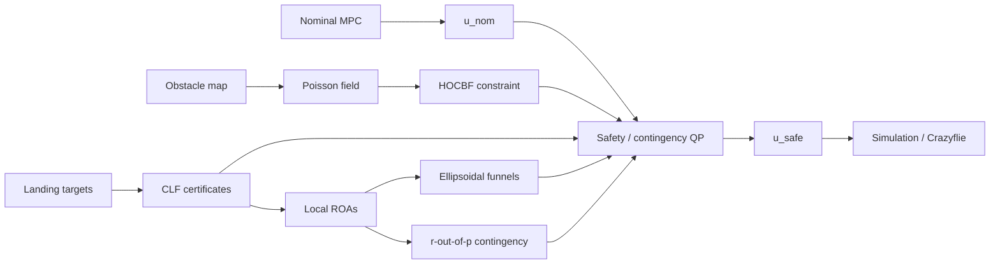

# Safety & Contingency Certificates for Autonomous Landing

<p align="center">
  <strong>MPC · Poisson safety fields · HOCBFs · CLFs · ellipsoidal funnels · r-out-of-p contingency · Crazyflie hardware validation</strong>
</p>

<p align="center">
  
</p>

## Overview

This repository studies a specific autonomy problem:

> **How can an aerial vehicle continue toward a landing objective while preserving safety and multiple viable alternatives when the environment or mission state changes?**

The method is intentionally layered:

1. a **nominal controller** proposes the task command;
2. a **Poisson-derived safety field** represents obstacle proximity;
3. a **high-order control barrier function** turns that field into an acceleration-level safety constraint;
4. **control Lyapunov functions** define locally stabilizing landing regions;
5. those local regions are connected into **ellipsoidal funnels**;
6. an **r-out-of-p contingency condition** tracks whether enough alternatives remain viable;
7. a minimum-intervention optimization modifies the nominal command only when required.

The objective is not merely collision avoidance. The autonomy stack should retain useful options and react coherently when obstacles move, landing zones become unavailable, or the nominal route loses viability.

---

## 1. Control architecture



Each block has a different role: the MPC is task-seeking, the HOCBF is safety-preserving, the CLF/ROA layer describes convergence, the funnel layer organizes safe local transitions, and the contingency layer reasons over multiple landing alternatives.

---

## 2. Reduced-order vehicle model

The translational state is

```math
x =
\begin{bmatrix}
p \\
v
\end{bmatrix}
```

with dynamics

```math
\dot p = v
```

and

```math
\dot v = u.
```

The control input `u` is interpreted as commanded translational acceleration in the reduced-order model used by the safety layer.

This abstraction is useful for certificate construction, but the physical vehicle additionally contains attitude dynamics, low-level tracking, sensing, delays, and actuator limits. Those effects are treated as a separate validation layer rather than silently absorbed into the reduced-order model.

---

## 3. Nominal MPC

The nominal controller solves a finite-horizon tracking problem of the form

```math
J =
\sum_{k=0}^{N-1}
\left[
(x_k-x_k^{ref})^T Q (x_k-x_k^{ref})
+
(u_k-u_k^{ref})^T R (u_k-u_k^{ref})
\right]
+
(x_N-x_N^{ref})^T Q_f (x_N-x_N^{ref}).
```

The first optimized input becomes

```math
u_{nom}=u_0^*.
```

This command is not assumed safe by itself. It is the reference around which the safety filter operates.

---

## 4. Poisson safety field

Let `Omega` denote the free workspace and `boundary(Omega)` the obstacle/workspace boundary. The safety field is constructed from a Poisson problem

```math
\Delta h_P(y)=f_P(y), \qquad y\in\Omega
```

with Dirichlet boundary condition

```math
h_P(y)=0, \qquad y\in\partial\Omega.
```

The numerical implementation evaluates:

- the scalar field `h_P`;
- its spatial gradient;
- its Hessian;
- interpolation and residual checks.

<p align="center">
  
</p>

The important distinction is between the **continuous PDE object** and the **sampled/interpolated numerical field**. The latter must be checked numerically before it is used inside a safety constraint.

---

## 5. Relative-degree-two HOCBF

For a spatial safety function `h(p)` under double-integrator dynamics,

```math
\dot h = \nabla h(p)^T v
```

and

```math
\ddot h =
\nabla h(p)^T u
+
v^T H_h(p) v.
```

A relative-degree-two barrier condition can then be written as

```math
\ddot h
+
(k_1+k_2)\dot h
+
k_1 k_2 h
\ge 0.
```

Substituting the derivatives gives the affine control constraint

```math
\nabla h(p)^T u
+
v^T H_h(p) v
+
(k_1+k_2)\nabla h(p)^T v
+
k_1 k_2 h(p)
\ge 0.
```

This is the mechanism that converts the Poisson field into a control constraint.

---

## 6. CLF landing certificates

For landing target `j`, define the equilibrium error

```math
e_j = x-x_j^*.
```

A quadratic control Lyapunov function is

```math
V_j(x)=e_j^T P_j e_j,
\qquad P_j \succ 0.
```

A candidate local region of attraction is the sublevel set

```math
R_j(c_j)=\{x : V_j(x)\le c_j\}.
```

Define the corresponding margin

```math
h_j^{ROA}(x)=c_j-V_j(x).
```

Then

```math
h_j^{ROA}(x)\ge0
```

means that the reduced-order state lies inside that candidate CLF sublevel set.

<p align="center">
  
</p>

This does not by itself certify obstacle clearance or full-order vehicle behavior; those are handled by the other layers.

---

## 7. Obstacle-limited ellipsoidal funnels

The funnel construction connects local CLF regions into a navigable corridor.

For funnel node `k`,

```math
V_k(x)=(x-x_k^*)^T P_k (x-x_k^*),
\qquad P_k \succ 0.
```

The allowed level is limited by three quantities:

- `c_k_dyn`: largest level compatible with the local control/Lyapunov condition;
- `c_k_obs`: largest level before obstacle contact;
- `c_k_dom`: largest level contained inside the local model/domain.

Instead of placing all quantifiers inside one fragile expression, the dynamic condition is stated explicitly:

```math
c_k^{dyn}=\sup_{c>0} c
```

subject to the requirement that, for every state satisfying

```math
0<V_k(x)\le c,
```

there exists an admissible control `u` such that

```math
L_f V_k(x)+L_g V_k(x)u
\le
-\alpha_k V_k(x).
```

Obstacle and domain limits are represented by

```math
c_k^{obs}=\min_{y\in C} V_k(y)
```

and

```math
c_k^{dom}=\min_{y\notin D_k} V_k(y).
```

The final certified level is

```math
c_k=
\beta
\min
\left(
c_k^{dyn},
c_k^{obs},
c_k^{dom}
\right),
\qquad 0<\beta<1.
```

The corresponding cell is

```math
E_k=\{x : V_k(x)\le c_k\}.
```

### 7.1 Connected corridor

Adjacent cells must overlap:

```math
E_k\cap E_{k+1}\neq\varnothing.
```

The overlap creates a handoff region between neighboring local controllers/certificates. A route is therefore a chain of **connected certified neighborhoods**, not a set of disconnected safe ellipsoids.

<p align="center">
  
</p>

### 7.2 Directed growth and branching

Candidate growth directions are scored relative to a mission direction `d_g`. For candidate direction `d_i`,

```math
s_i=d_i^T d_g.
```

The branch with the largest admissible score is preferred, subject to:

- local CLF/control feasibility;
- obstacle-free containment;
- domain validity;
- overlap with the previous cell;
- feasible handoff;
- actuator/input limits.

This keeps the mathematical idea clear without introducing notation that obscures the implementation.

### 7.3 Dynamic reconstruction

When obstacle geometry changes, affected cells can be invalidated and the corridor regrown locally rather than rebuilding the entire structure from scratch. This is the mechanism tested in the dynamic-obstacle experiment below.

---

## 8. r-out-of-p contingency

Suppose there are `p` landing alternatives with margins

```math
h_1^{ROA}, h_2^{ROA}, \ldots, h_p^{ROA}.
```

Sort the margins from largest to smallest:

```math
h_{[1]}\ge h_{[2]}\ge\cdots\ge h_{[p]}.
```

Define the contingency pivot

```math
\widetilde h_r=h_{[r]}.
```

The requirement

```math
\widetilde h_r\ge0
```

is equivalent to preserving at least `r` nonnegative landing-zone certificates.

Therefore:

- `r=1`: preserve at least one viable landing alternative;
- `r=p`: preserve all alternatives;
- intermediate `r`: preserve a required number without over-constraining every site.

<p align="center">
  
</p>

The implementation separates **site availability** from **certificate validity**. A site can be removed by mission logic even if its geometric/CLF margin remains positive.

---

## 9. Minimum-intervention safety filter

The final control stage projects the nominal command onto the active safety and contingency constraints:

```math
\min_{u,\delta}
\frac{1}{2}
(u-u_{nom})^T W (u-u_{nom})
+
\rho\delta^2.
```

The optimization is subject to:

- environmental HOCBF constraints;
- CLF constraints;
- active contingency constraints;
- actuator limits;
- workspace limits.

The intended behavior is **minimum intervention**: when the nominal command is already compatible with all active constraints, the filter should modify it as little as possible.

---

# 10. Hardware and real-time demonstrations

These experiments are tied directly to the corresponding theoretical component rather than presented as a generic media gallery.

## 10.1 Poisson vs. funnel comparison on hardware

<p align="center">
  <a href="https://www.youtube.com/watch?v=I9Rh-Ju7ocI">
    
  </a>
</p>

**What it tests:** two different safety representations acting on the same physical vehicle/obstacle problem.

**What it demonstrates:** the qualitative difference between field-based Poisson guidance and corridor/funnel-based route construction on hardware.

---

## 10.2 Contingency preservation on hardware

<p align="center">
  <a href="https://www.youtube.com/watch?v=16uhNCGDFyw">
    
  </a>
</p>

**What it tests:** whether the controller can continue operating while maintaining multiple landing alternatives instead of committing immediately to a single target.

**Theory connection:** the experiment corresponds to the r-out-of-p contingency logic described in Section 8.

---

## 10.3 Real-time funnel reconstruction with moving obstacles

<p align="center">
  <a href="https://www.youtube.com/watch?v=qNBieBZaMSQ">
    
  </a>
</p>

**What it tests:** online invalidation and reconstruction of the corridor when obstacle geometry changes.

**Theory connection:** this is the dynamic version of the overlap/growth mechanism described in Section 7.

---

## 10.4 Funnels integrated with reachability and contingency

<p align="center">
  <a href="https://www.youtube.com/watch?v=FZlIpveyAJU">
    
  </a>
</p>

**What it tests:** real-time interaction among local reachability certificates, funnel construction, and contingency preservation.

**Interpretation:** this experiment is the closest representation of the complete research concept, but it should still be read as implementation evidence rather than a proof of full-order closed-loop guarantees.

---

## 11. Validation logic

The project separates six levels of evidence:

| Level | Question |
|---|---|
| **Analytical derivation** | Is the constraint mathematically correct under the reduced-order assumptions? |
| **Numerical field/certificate checks** | Are the PDE, derivatives, level sets, and constraints represented correctly in software? |
| **Closed-loop simulation** | Does the implemented controller satisfy the intended constraints in sampled simulation? |
| **Sub-step / inter-sample checks** | Are violations hidden between controller updates? |
| **Hardware experiment** | Does the physical vehicle reproduce the intended response in the tested configuration? |
| **Full-order guarantee** | Can tracking error, delays, sensing uncertainty, and low-level dynamics be bounded strongly enough to lift the reduced-order certificate to the physical vehicle? |

Success at one level does not automatically imply the next.

---

## 12. Repository structure

```text
poisson_safety_box/       Poisson field and derivatives
cbf_safety_box/           CBF / HOCBF constraints
clf_safety_box/           CLFs and local landing certificates
contingency_safety_box/   r-out-of-p contingency logic
safety_filter_box/        minimum-intervention constrained control
safety_box_core/          shared interfaces
experiments/              deterministic scenarios and validation
configs/                  model and experiment configuration
tests/                    unit / integration / scientific tests
docs/                     mathematical notes and validation material
```

---

## 13. Reproduction

Install dependencies:

```bash
python -m pip install -r requirements.txt
```

Run the integrated study:

```bash
python run_poisson_cbf_contingency_landing_study.py
```

Run the repository test suite:

```bash
pytest -q
```

Any timing result should be interpreted together with the exact commit, machine, numerical backend, and scenario configuration used for that benchmark.

---

## 14. References

1. A. D. Ames, X. Xu, J. W. Grizzle, and P. Tabuada, **Control Barrier Function Based Quadratic Programs for Safety Critical Systems**, IEEE Transactions on Automatic Control, 2017.
2. A. D. Ames et al., **Control Barrier Functions: Theory and Applications**, European Control Conference, 2019.
3. W. Xiao and C. Belta, **High-Order Control Barrier Functions**, IEEE Transactions on Automatic Control, 2022.
4. G. Bahati, R. M. Bena, and A. D. Ames, **Dynamic Safety in Complex Environments: Synthesizing Safety Filters with Poisson's Equation**, 2025.
5. R. Tedrake et al., **LQR-Trees: Feedback Motion Planning on Sparse Randomized Trees**, RSS, 2009.
6. M. Tobenkin, I. Manchester, and R. Tedrake, **Invariant Funnels Around Trajectories Using Sum-of-Squares Programming**, 2011.
7. A. Majumdar and R. Tedrake, **Funnel Libraries for Real-Time Robust Feedback Motion Planning**, IJRR, 2017.
8. P. Ong et al., **Combinatorial Control Barrier Functions**, 2025.
9. Y. Lishkova et al., **Steering with Contingencies: Combinatorial Stabilization and Reach-Avoid Filters**, 2026.
10. D. Q. Mayne et al., **Constrained Model Predictive Control: Stability and Optimality**, Automatica, 2000.

---

## Research status

The repository contains a working modular implementation and hardware demonstrations. The **ellipsoidal funnel / contingency integration remains under formal theoretical validation**, particularly when moving obstacles, sensing uncertainty, sampled-data execution, tracking error, and full-order flight dynamics are included.
