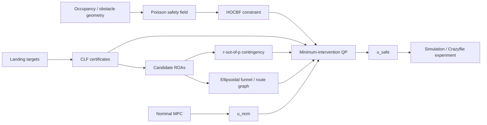

# Safety & Contingency Certificates for Autonomous Landing

<p align="center">
  <strong>MPC · Poisson safety fields · HOCBFs · CLFs · obstacle-limited ellipsoidal funnels · r-out-of-p contingency · hardware validation</strong>
</p>

<p align="center">
  
</p>

## Research question

**How can an aerial vehicle pursue a nominal landing objective while preserving multiple feasible alternatives when obstacles, target availability, or mission conditions change?**

The framework separates nominal task execution from safety and contingency. A predictive controller generates the nominal command; environmental safety is enforced through differentiable barrier constraints; target convergence is described through Lyapunov functions; and contingency logic tracks whether enough alternative landing regions remain viable.

The Caltech SURF formulation combines four ideas:

1. **MPC** for the nominal task command;
2. **Poisson/PDE safety fields + HOCBF constraints** for obstacle avoidance;
3. **CLF-derived regions of attraction** for landing stabilization;
4. **overlapping ellipsoidal funnels and r-out-of-p certificates** for safe route construction and contingency preservation.

> **Current claim boundary.** The reduced-order mathematical framework and deterministic simulation suite are more mature than the full hardware theory. Crazyflie experiments demonstrate implementation behavior, but formal guarantees for the complete sampled-data, perception, low-level-flight, and dynamic-obstacle stack remain ongoing.

---

## 1. System architecture



The boxes are intentionally modular: geometry, stabilization, contingency, and command filtering are evaluated separately before being coupled.

---

## 2. Reduced-order dynamics and nominal MPC

The principal translational model is

```math
x =
\begin{bmatrix}
p \\
v
\end{bmatrix},
\qquad
\dot p = v,
\qquad
\dot v = a,
\qquad
u=a.
```

For a finite prediction horizon, the nominal MPC solves a constrained tracking problem of the form

```math
\min_{u_{0:N-1}}
\sum_{k=0}^{N-1}
\left[
(x_k-x_k^{\mathrm{ref}})^\mathsf{T}Q(x_k-x_k^{\mathrm{ref}})
+
(u_k-u_k^{\mathrm{ref}})^\mathsf{T}R(u_k-u_k^{\mathrm{ref}})
\right]
+
(x_N-x_N^{\mathrm{ref}})^\mathsf{T}Q_f(x_N-x_N^{\mathrm{ref}})
```

subject to the discrete dynamics and state/input bounds. Only the first optimal control is applied before the problem is solved again.

The command leaving the nominal layer is denoted

```math
u_{\mathrm{nom}} = u_0^\star.
```

This is the task-seeking command **before** any safety or contingency correction.

---

## 3. Poisson safety field

A metric occupancy map defines the free domain `Omega`; obstacle and workspace surfaces define its boundary.

The continuous safety-field construction is based on

```math
\Delta h_P(y)=f_P(y),
\qquad y\in\Omega,
```

with Dirichlet condition

```math
h_P(y)=0,
\qquad y\in\partial\Omega.
```

With a negative interior forcing under the regularity assumptions used by the continuous problem, the Poisson solution is positive in the free-space interior and approaches zero at the boundary. Numerically, the repository evaluates the scalar field together with its first and second spatial derivatives.

<p align="center">
  
</p>

The important engineering distinction is that the **continuous PDE result** and the **sampled/interpolated grid object** are not automatically equivalent. The numerical implementation therefore exposes solver residuals, interpolation checks, collision guards, and derivative diagnostics instead of treating the field alone as a complete proof.

---

## 4. Relative-degree-two HOCBF

For the double-integrator model, a spatial safety function does not depend on acceleration at first derivative:

```math
\dot h_e
=
D h_e(p)\,v.
```

The control appears at second derivative:

```math
\ddot h_e
=
D h_e(p)\,a
+
v^\mathsf{T}D^2h_e(p)v.
```

Using linear extended-class-K gains `gamma_1` and `gamma_2`, the implemented HOCBF inequality is

```math
D h_e\,a
+
v^\mathsf{T}D^2h_e\,v
+
(\gamma_1+\gamma_2)D h_e\,v
+
\gamma_1\gamma_2 h_e
\ge 0.
```

This equation is the explicit bridge between the Poisson field and the acceleration-level safety filter: the field provides the value, gradient, and curvature terms needed by the affine control constraint.

<p align="center">
  
</p>

---

## 5. CLF landing certificates

For landing target `j`, define the equilibrium `x_j_star` and error `e_j = x - x_j_star`. A quadratic CLF is

```math
V_j(x)
=
e_j^\mathsf{T}P_j e_j,
\qquad
P_j \succ 0.
```

The candidate attraction region is represented by the sublevel set

```math
\mathcal R_j(c_j)
=
\left\{
x:
V_j(x)\le c_j
\right\}.
```

Equivalently, define the reachability margin

```math
h_j^{\mathrm{ROA}}(x)
=
c_j - V_j(x).
```

Then

```math
h_j^{\mathrm{ROA}}(x)\ge0
\quad\Longleftrightarrow\quad
x\in\mathcal R_j(c_j).
```

<p align="center">
  
</p>

A positive margin means that the current reduced-order state lies inside the corresponding candidate CLF sublevel set. It does **not** by itself prove environmental safety, full-order feasibility, or tracking performance.

---

# 6. Obstacle-limited ellipsoidal funnels

The funnel construction is the core geometric extension used to connect local CLF regions into a route.

A local quadratic certificate around node `k` is

```math
V_k(x)
=
(x-x_k^\star)^\mathsf{T}
P_k
(x-x_k^\star),
\qquad
P_k\succ0.
```

The admissible level is clipped by three independent limits:

```math
c_k^{\mathrm{dyn}}
=
\sup
\left\{
c>0:
\forall x,\ 0<V_k(x)\le c,
\ \exists u\in\mathcal U
\text{ such that }
L_fV_k+L_gV_k u
\le
-\alpha_k(V_k)
\right\},
```

```math
c_k^{\mathrm{obs}}
=
\inf_{y\in\mathcal C}V_k(y),
\qquad
c_k^{\mathrm{dom}}
=
\inf_{y\notin\mathcal D_k}V_k(y),
```

and

```math
c_k
=
\gamma
\min
\left\{
c_k^{\mathrm{dyn}},
c_k^{\mathrm{obs}},
c_k^{\mathrm{dom}}
\right\},
\qquad
0<\gamma<1.
```

The resulting certified cell is

```math
\mathcal E_k
=
\left\{
x:
V_k(x)\le c_k
\right\},
\qquad
h_k(x)=c_k-V_k(x).
```

This construction makes the cell size depend on **control feasibility, obstacle contact, and model validity**, rather than on an arbitrary fixed radius.

### 6.1 Geometric representation

For visualization in position space, an ellipsoidal cell can be represented as

```math
\mathcal F_k
=
\left\{
p:
g_k(p)\ge0
\right\},
```

with

```math
g_k(p)
=
1
-
(p-c_k)^\mathsf{T}
Q_k^{-1}
(p-c_k).
```

<p align="center">
  
</p>

### 6.2 Connected corridor

Neighboring cells must overlap:

```math
\mathcal E_k
\cap
\mathcal E_{k+1}
\neq
\varnothing.
```

Switching is restricted to a verified overlap/guard region. The route is therefore not a sequence of disconnected safe bubbles; it is a connected chain of locally certified regions.

### 6.3 Directed growth and branching

The route grows toward mission-relevant directions while stopping at dynamic, obstacle, or domain limits. A directional branch selection can be written schematically as

```math
d_i^\star
\in
\operatorname*{arg\,max}_{d_i}
d_i^\mathsf{T}d_g,
```

subject to the local viability, collision-free containment, overlap, handoff, and input-feasibility conditions.

This is closely related to ideas from LQR-Trees, invariant funnel libraries, obstacle-free convex-region inflation, and sequential composition. The research contribution under study is the **specific coupling** of CLF-valid level sets, obstacle-clipped growth, directed branching, verified handoff, and contingency preservation—not the individual concepts in isolation.

---

## 7. r-out-of-p contingency

For `p` candidate landing zones, define the order-statistic pivot

```math
\widetilde h_r(x)
=
\max^{(r)}
\left\{
h_1^{\mathrm{ROA}}(x),
\ldots,
h_p^{\mathrm{ROA}}(x)
\right\},
```

where `max^(r)` denotes the r-th largest certificate value.

The contingency condition is

```math
\widetilde h_r(x)\ge0.
```

Equivalently,

```math
\widetilde h_r(x)\ge0
\quad\Longleftrightarrow\quad
\#\left\{
j:
h_j^{\mathrm{ROA}}(x)\ge0
\right\}
\ge r.
```

Thus:

- `r = 1`: at least one landing alternative remains certified;
- `r = p`: all alternatives must remain certified;
- intermediate `r`: preserve a required number of alternatives without enforcing every candidate simultaneously.

<p align="center">
  
</p>

The implementation distinguishes **availability** from **certification**. A site may remain physically available but not be reachable from the current certified state; conversely, a positive CLF margin is ignored if mission logic has declared the site unavailable.

---

## 8. Minimum-intervention safety filter

The control layer is organized as a constrained projection around the nominal command. A schematic form is

```math
\min_{u,\delta_V}
\frac{1}{2}
\left\|
u-u_{\mathrm{nom}}
\right\|_W^2
+
\rho_V\delta_V^2,
```

subject to the active environmental HOCBF, CLF, contingency, actuator, and workspace constraints.

Safety and contingency rows are treated as hard constraints in the reference formulation; the CLF can use an explicitly penalized relaxation when required.

---

## 9. Experimental evidence

### Poisson-field hardware experiment

<p align="center">
  <a href="https://raw.githubusercontent.com/kosmicplane/kosmicplane.github.io/main/assets/media/caltech-poisson.mp4">
    
  </a>
</p>

### Poisson ↔ funnel comparison

<p align="center">
  <a href="https://raw.githubusercontent.com/kosmicplane/kosmicplane.github.io/main/assets/media/caltech-method-comparison.mp4">
    
  </a>
</p>

### Dynamic-obstacle funnel reconstruction

<p align="center">
  <a href="https://raw.githubusercontent.com/kosmicplane/kosmicplane.github.io/main/assets/media/caltech-dynamic-funnel.mp4">
    
  </a>
</p>

### Contingency switching

<p align="center">
  <a href="https://raw.githubusercontent.com/kosmicplane/kosmicplane.github.io/main/assets/media/caltech-contingency.mp4">
    
  </a>
</p>

> Click a figure to open the associated MP4. These videos are experimental evidence of the implementation behavior; they are not substitutes for the formal assumptions required by the reduced-order certificates.

---

## 10. Validation hierarchy

The repository separates evidence into distinct levels:

| Level | Question |
|---|---|
| **Analytical** | Is the mathematical constraint derived correctly under its stated assumptions? |
| **Numerical** | Does the discretized / interpolated implementation preserve the intended residuals and signs? |
| **Closed-loop simulation** | Do sampled trajectories satisfy the implemented certificates? |
| **Fine-substep validation** | Are violations observed between controller samples under the numerical hold model? |
| **Hardware experiment** | Does the physical system reproduce the intended behavior under the tested setup? |
| **Full-order guarantee** | Can tracking, estimation, delays, perception, and low-level dynamics be bounded tightly enough to lift the reduced-order certificate to the physical vehicle? |

The last level is **not** implied by success at the earlier levels.

---

## 11. Repository organization

```text
poisson_safety_box/       occupancy → Poisson field → derivatives
cbf_safety_box/           HOCBF / CBF affine constraints
clf_safety_box/           CLFs, landing equilibria, candidate ROAs
contingency_safety_box/   r-out-of-p availability / certification logic
safety_filter_box/        minimum-intervention constrained control
safety_box_core/          shared interfaces and data contracts
experiments/              deterministic scenarios and validation
configs/                  experiment and model configuration
tests/                    unit / integration / scientific regression tests
docs/                     mathematical and validation documentation
```

---

## 12. Reproducing the reference studies

Install dependencies:

```bash
python -m pip install -r requirements.txt
```

Run the integrated landing study:

```bash
python run_poisson_cbf_contingency_landing_study.py
```

Run the repository checks:

```bash
pytest -q
```

Because the project is still evolving, any reported test count or timing should be tied to a specific commit, environment, and benchmark configuration.

---

## 13. Primary references

1. A. D. Ames, X. Xu, J. W. Grizzle, and P. Tabuada, **Control Barrier Function Based Quadratic Programs for Safety Critical Systems**, IEEE TAC, 2017.
2. A. D. Ames et al., **Control Barrier Functions: Theory and Applications**, ECC, 2019.
3. W. Xiao and C. Belta, **High-Order Control Barrier Functions**, IEEE TAC, 2022.
4. G. Bahati, R. M. Bena, and A. D. Ames, **Dynamic Safety in Complex Environments: Synthesizing Safety Filters with Poisson's Equation**, 2025.
5. R. Tedrake et al., **LQR-Trees: Feedback Motion Planning on Sparse Randomized Trees**, RSS, 2009.
6. M. Tobenkin, I. Manchester, and R. Tedrake, **Invariant Funnels Around Trajectories Using Sum-of-Squares Programming**, 2011.
7. A. Majumdar and R. Tedrake, **Funnel Libraries for Real-Time Robust Feedback Motion Planning**, IJRR, 2017.
8. P. Ong et al., **Combinatorial Control Barrier Functions: Nested Boolean and p-Choose-r Compositions of Safety Constraints**, 2025.
9. Y. Lishkova et al., **Steering with Contingencies: Combinatorial Stabilization and Reach-Avoid Filters**, 2026.
10. D. Q. Mayne et al., **Constrained Model Predictive Control: Stability and Optimality**, Automatica, 2000.

---

## Scientific status

The repository supports a modular and testable safety/contingency architecture and includes simulation plus Crazyflie experiments. The **ellipsoidal funnel construction is still under formal validation** as a certified safety-and-contingency mechanism, especially when numerical interpolation, sampled-data execution, changing obstacles, sensing degradation, and full-order flight dynamics are included.
